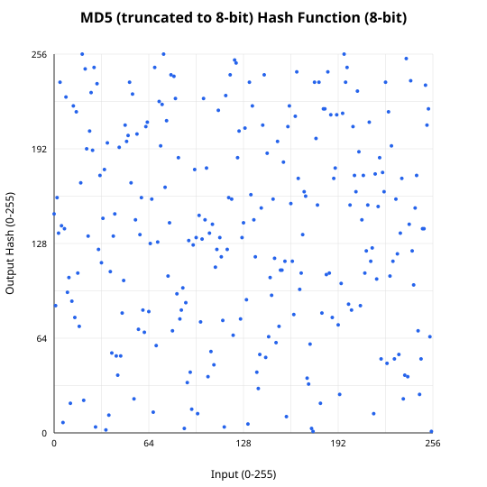
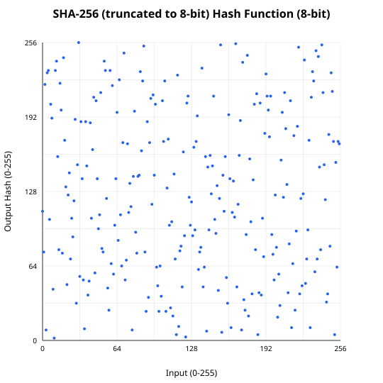
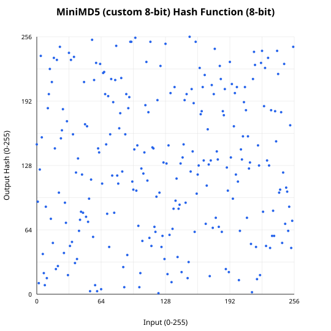
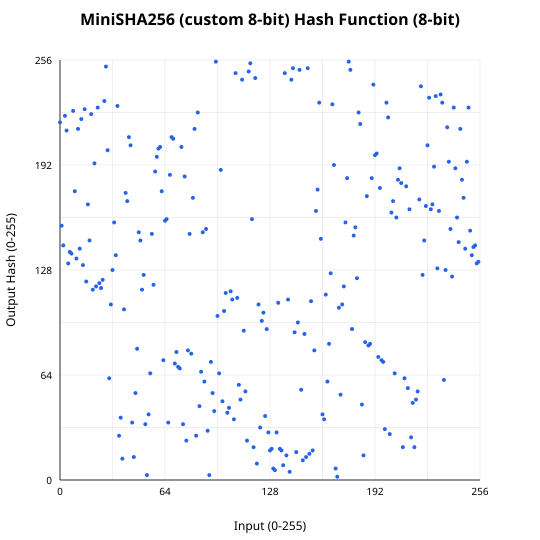

# hash-inversion

A Rust library demonstrating hash inversion through precomputed lookup tables for 8-bit hash functions.

[](https://github.com/konard/hash-inversion/actions)
[](https://www.rust-lang.org/)
[](http://unlicense.org/)

## Core Idea

Cryptographic hash functions like MD5 and SHA-256 are designed to be one-way functions, meaning given a hash output, it should be computationally infeasible to find the original input (preimage resistance). However, when we reduce the hash output to a small number of bits (like 8 bits), the space of possible outputs becomes small enough (256 values) that we can precompute a lookup table mapping every possible hash value back to an input that produces it.

This library implements:
- **8-bit truncated hash functions** (MD5, SHA-256)
- **Custom 8-bit hash functions** (MiniMD5, MiniSHA256)
- **Precomputed lookup tables** for O(1) hash inversion
- **Embedded const arrays** with preimages for all 256 hash values

## Hash Function Visualizations

The following plots show the behavior of each 8-bit hash function for inputs 0-255:

### MD5 (truncated to 8-bit)


### SHA-256 (truncated to 8-bit)


### MiniMD5 (custom 8-bit)


### MiniSHA256 (custom 8-bit)


## Features

- **8-bit Hash Functions**: MD5 and SHA-256 truncated to 8 bits, plus custom MiniMD5 and MiniSHA256
- **Hash Inversion**: Find preimages using precomputed lookup tables
- **O(1) Lookup**: Embedded const arrays enable instant preimage retrieval
- **Full Coverage**: Every hash value (0-255) has a valid preimage
- **Cross-platform**: Works on Linux, macOS, and Windows

## Quick Start

```rust
use hash_inversion::{
    md5_8bit, sha256_8bit, mini_md5, mini_sha256,
    lookup_md5_8bit_preimage, lookup_sha256_8bit_preimage,
    lookup_mini_md5_preimage, lookup_mini_sha256_preimage,
};

fn main() {
    // Compute 8-bit hashes
    let data = b"hello";
    println!("MD5 8-bit: {}", md5_8bit(data));
    println!("SHA-256 8-bit: {}", sha256_8bit(data));
    println!("MiniMD5: {}", mini_md5(data));
    println!("MiniSHA256: {}", mini_sha256(data));

    // Invert a hash using embedded lookup tables
    let hash_value = 42u8;
    let preimage = lookup_md5_8bit_preimage(hash_value);
    assert_eq!(md5_8bit(preimage), hash_value);
    println!("Found preimage for MD5 hash {}: {:?}", hash_value, preimage);
}
```

## API Reference

### Hash Functions

| Function | Description |
|----------|-------------|
| `md5_8bit(&[u8]) -> u8` | First byte of MD5 hash |
| `md5_16bit(&[u8]) -> u16` | First 2 bytes of MD5 hash |
| `sha256_8bit(&[u8]) -> u8` | First byte of SHA-256 hash |
| `sha256_16bit(&[u8]) -> u16` | First 2 bytes of SHA-256 hash |
| `mini_md5(&[u8]) -> u8` | Custom 8-bit hash (MD5-inspired) |
| `mini_sha256(&[u8]) -> u8` | Custom 8-bit hash (SHA-256-inspired) |
| `simple_hash(u8) -> u8` | Bijective 8-bit permutation |

### Lookup Functions (Embedded Tables)

| Function | Description |
|----------|-------------|
| `lookup_md5_8bit_preimage(u8) -> &'static [u8]` | O(1) preimage lookup for MD5 8-bit |
| `lookup_sha256_8bit_preimage(u8) -> &'static [u8]` | O(1) preimage lookup for SHA-256 8-bit |
| `lookup_mini_md5_preimage(u8) -> &'static [u8]` | O(1) preimage lookup for MiniMD5 |
| `lookup_mini_sha256_preimage(u8) -> &'static [u8]` | O(1) preimage lookup for MiniSHA256 |

### Dynamic Lookup Tables

For dynamic use cases, you can build lookup tables at runtime:

```rust
use hash_inversion::HashLookupTable;

let table = HashLookupTable::new_md5_8bit();
let preimage = table.lookup(0x42).unwrap();
```

## Development

```bash
# Build the project
cargo build

# Run tests
cargo test

# Run the demo binary
cargo run

# Generate hash visualization plots
node scripts/generate-plots.mjs

# Regenerate embedded lookup tables (if hash functions change)
cargo run --example generate_tables
```

## Project Structure

```
.
├── src/
│   ├── lib.rs            # Main library with hash functions
│   ├── lookup_tables.rs  # Embedded precomputed lookup tables
│   ├── main.rs           # Demo binary
│   └── tests.rs          # Unit tests
├── examples/
│   ├── generate_tables.rs    # Generate lookup table code
│   └── generate_hash_data.rs # Generate data for plotting
├── plots/                # Auto-generated hash visualizations
│   ├── md5_8bit.svg
│   ├── sha256_8bit.svg
│   ├── mini_md5.svg
│   └── mini_sha256.svg
├── scripts/
│   └── generate-plots.mjs    # Plot generation script
└── tests/
    └── integration_test.rs   # Integration tests
```

## How It Works

### Hash Inversion via Lookup Tables

For an 8-bit hash function, there are only 256 possible output values. We can precompute a lookup table that maps each output value to one input that produces it:

1. **Table Generation**: For each hash value 0-255, find the smallest input that produces it
2. **Storage**: Store preimages as `(length, byte0, byte1)` tuples in const arrays
3. **Lookup**: Given a hash value, return the preimage in O(1) time

### Embedded vs Dynamic Tables

- **Embedded tables** (`lookup_*_preimage` functions): Precomputed at compile time, zero runtime cost
- **Dynamic tables** (`HashLookupTable`): Built at runtime, useful for experimentation

## Contributing

Contributions are welcome! Please see [CONTRIBUTING.md](CONTRIBUTING.md) for guidelines.

## License

[Unlicense](LICENSE) - Public Domain

This is free and unencumbered software released into the public domain.
